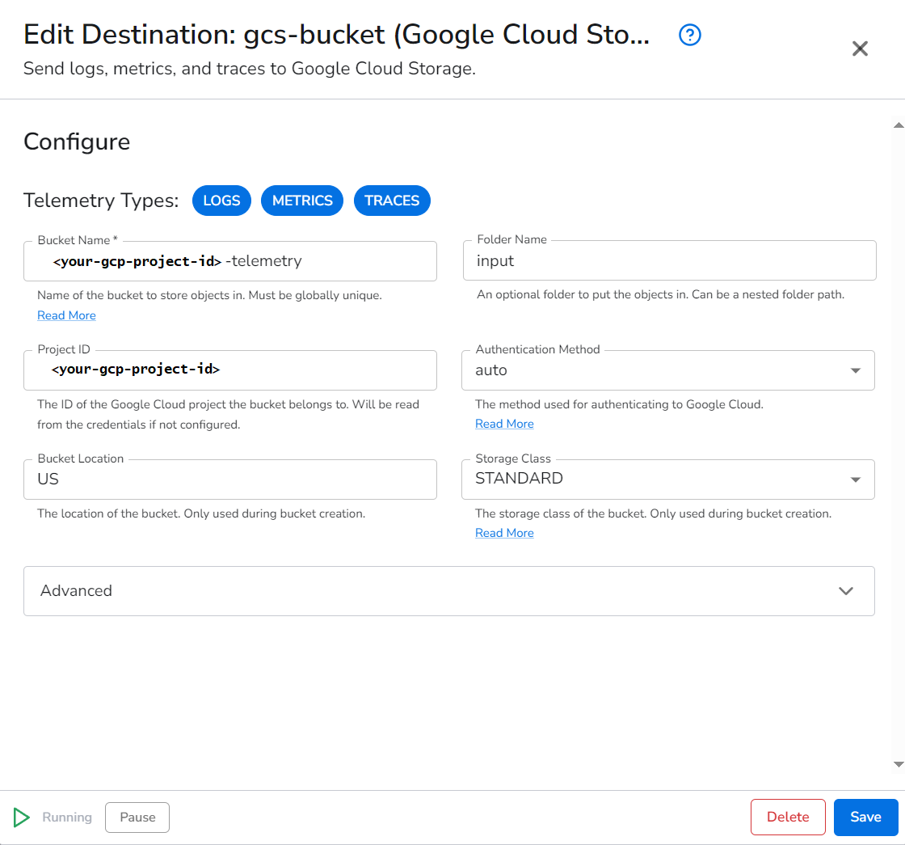
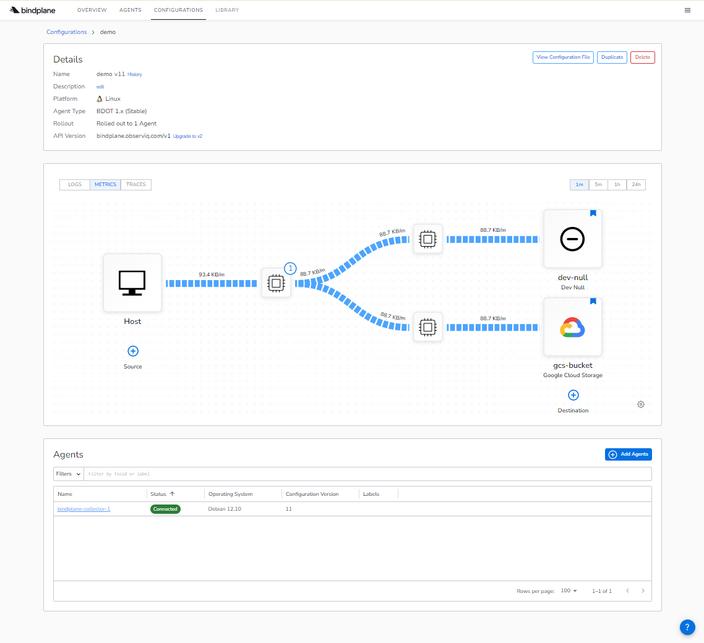

# Anomaly Detection on GCP with Apache Beam

This project implements an Anomaly Detection pipeline using Apache Beam on Google Cloud Platform (GCP). Infrastructure is provisioned using Terraform.

[Apache Beam](https://beam.apache.org/) is a unified programming model for both batch and streaming data processing. In this project, it will be used for real-time anomaly detection on streaming data using Google Cloud Dataflow as the runner.

## Prerequisites

1. [Terraform](https://developer.hashicorp.com/terraform/tutorials/aws-get-started/install-cli)

1. Google Gmail account

1. [Google Cloud project](https://cloud.google.com/docs/get-started)

1. [Google Cloud CLI (`gcloud`)](https://cloud.google.com/sdk/docs/install)

## Setup

1. Create and activate a gcloud configuration pointing to your Google Cloud project:

   ```bash
   gcloud init
   ```

1. Authenticate:

   ```bash
   gcloud auth application-default login
   ```

1. Configure project-specific variables:

   Copy the [`terraform/terraform.tfvars.templ`](terraform/terraform.tfvars.templ) file as `terraform/terraform.tfvars`:

   ```bash
   cp terraform/terraform.tfvars.templ terraform/terraform.tfvars
   ```

   Edit `terraform/terraform.tfvars` and set at least these variables, replacing the place holder values with actual values like your own Google Cloud project ID, etc. :

   ```hcl
   project_id = "your-gcp-project-id"
   project_number = "your-gcp-project-number"
   tf_state_bucket_name = "your-unique-tf-state-bucket-name"
   ```

   ATTENTION: Never add `terraform/terraform.tfvars` to version control! It contains sensitive information that should be kept secret.

1. Bootstrap the Terraform state bucket:

   ```bash
   makefile tf-bootstrap
   ```

1. Initialize Terraform using the remote state bucket:

   ```bash
   makefile tf-init
   ```

1. Provision the Google Cloud resources in your project:

   ```bash
   cd terraform
   terraform plan
   terraform apply
   ```

1. On GCP, ssh into the `bindplane-server` GCE instance (VM) and manually perform the following tasks:

   - [Install Docker](https://docs.docker.com/engine/install/debian/#install-using-the-convenience-script)

   - Add your user to the docker group:
      ```bash
      sudo usermod -aG docker `whoami`
      ```

   - Log out and log back in to apply group membership changes.

   - [Install the Bindplane OP Server](https://bindplane.com/download) 
      - Edit the `docker-compose.yml` file and enter/change these values:
         - `BINDPLANE_LICENSE` must have a valid licence;
         - `BINDPLANE_REMOTE_URL` should be set to `http://bindplane-server:3001`.
      - To start, if `docker compose up -d` doesn't work, try `docker-compose up -d` instead. 
   
1. On your local machine, use an IAP TCP Tunnel + local port forward to open the Bindplane OP Server UI:

   ```bash
   make iap-tunnel
   ```

1. Open your Web browser and go to [http://localhost:3001/agents](http://localhost:3001/agents). Log in as admin user (with the username and password set in the `docker-compose.yml` file), then click on "Install Your First Agent". At the end, you should get a command you can copy and run on the Bindplane Collector VM.

1. Back on GCP, ssh into the `bindplane-collector-1` GCE instance (VM)
   - To avoid `nf_conntrack` errors showing up in the Collector's logs later on:
      - Load the `nf_conntrack` module:
         ```bash
         sudo modprobe nf_conntrack
         ```
      - Verify it's loaded:
         ```bash
         lsmod | grep nf_conntrack
         ```
      - Check the sysctl file appears:
         ```bash
         ls /proc/sys/net/netfilter/nf_conntrack_count
         ```

   - Install the Bindplane Agent using the command you got from your Bindplane OP Server (previous step).


1. Back to the Bindplane OP Server Web UI
   - Create a new configuration, name it "demo" or whatever you like, and add these components to it:
      - Add a `Host` source, with the "Mute Process Username Errors" option enabled
   
      - Add a `Dev Null` source;
   
      - Add a `Google Cloud Storage` destination, like shown in the image below. In both Bucket Name and Project ID fields, replace `<your-gcp-project>` with the project ID of your own Google Cloud project. But keep the `-telemetry` suffix at the end of the Bucket Name. Set Folder Name to `input`, and Authentication Method to `auto`. Save.
   
         
   
   - Add the `bindplane-collector-1` agent to the configuration and rollout the configuration.

   - The next image show the expected configuration screen after the roll-out:
   
      

   - Note this configuration generates only Metrics, there is no Logs or Traces in the chosen source.


## What’s Deployed

The Terraform configuration will provision infrastructure required to support the Apache Beam anomaly detection pipeline, including:

- A GCS bucket for storing Terraform state
- IAM roles and service accounts
- Additional resources as needed
- (Planned) Dataflow-related resources for running Apache Beam pipelines


## Project Structure

```
anomaflow/
├── data/
│   ├── input/              # Fake input for local runs
│   └── output/             # Files written when running locally
├── images/
├── makefile
├── python/                 # Apache Beam pipeline code
├── terraform/
│   └── bootstrap/          # Terraform code to create the state bucket
└── README.md
```


## Next Steps

- Integrate with Pub/Sub, BigQuery, and other GCP services
- Add CI/CD automation for Terraform and Beam deployment

